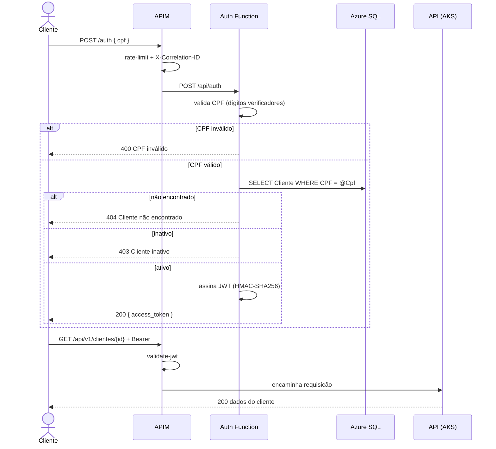

# PosTech Auth Function

Function serverless de **autenticação de cliente por CPF** do Tech Challenge Fase 3 (13SOAT).

Valida o CPF informado, confirma que o cliente existe e está ativo na base, e devolve um **JWT**
aceito pelas rotas protegidas da API principal — que fica atrás do Azure API Management.

## Propósito

O enunciado da Fase 3 exige uma função serverless que:

1. valide o CPF do cliente;
2. consulte a existência **e o status** do cliente na base de dados;
3. gere e devolva um token JWT válido para consumo das APIs protegidas.

Esta Function é o item 1 dos quatro repositórios da entrega.

## Tecnologias

| Item | Escolha |
|---|---|
| Runtime | Azure Functions v4, **.NET 8 isolated worker** |
| Acesso a dados | Dapper + `Microsoft.Data.SqlClient` |
| Banco | Azure SQL Database (tabela `Cliente`) |
| Token | `System.IdentityModel.Tokens.Jwt` — HMAC-SHA256 |
| Segredos | Azure Key Vault via App Settings references |
| Testes | xUnit |
| CI/CD | GitHub Actions + OIDC (sem segredo de cliente) |

## Contrato da API

### `POST /api/auth`

```json
{ "cpf": "123.456.789-09" }
```

O CPF é aceito com ou sem máscara.

| Status | Quando | Corpo |
|---|---|---|
| `200` | Cliente existe e está ativo | `{ "access_token", "token_type", "expires_in", "cliente_id", "nome" }` |
| `400` | CPF ausente, malformado ou com dígito verificador inválido | `{ "message", "correlationId" }` |
| `404` | CPF não cadastrado | `{ "message", "correlationId" }` |
| `403` | Cliente existe mas está inativo (`Ativo = 0`) | `{ "message", "correlationId" }` |

### `GET /api/health`

Retorna `200 {"status":"healthy"}`. Usado pelo synthetics do Datadog e pelo smoke test da pipeline.

### Correlação

A Function lê o header `X-Correlation-ID` (injetado pelo APIM) e o devolve na resposta. Se ausente,
gera um. O valor entra no escopo do logger, então aparece em todo log JSON da requisição.

## Fluxo de autenticação



## Compatibilidade do token com a API

A API principal valida o JWT com `ValidateIssuerSigningKey`, `ValidateIssuer`, `ValidateAudience`,
`ValidateLifetime` e `ClockSkew = TimeSpan.Zero`. Portanto issuer, audience, algoritmo e segredo
**precisam bater exatamente**:

| Campo | Valor |
|---|---|
| Algoritmo | `HS256` |
| Issuer | `PosTechChallenge` |
| Audience | `PosTechChallenge-API` |
| Segredo | mínimo 32 bytes, compartilhado via Key Vault |

Claims emitidas: `nameidentifier`, `role = Cliente`, `ClienteId`, `cpf`, `name`.

`TokenServiceTests` replica os `TokenValidationParameters` da API e valida o token gerado contra
eles — se esses testes passam, a API aceita o token sem nenhuma alteração.

## Executar localmente

Pré-requisitos: .NET 8 SDK, [Azure Functions Core Tools v4], e um SQL Server com o schema
de `infra/sql/init.sql` do repositório da aplicação.

```bash
cp src/PosTech.AuthFunction/local.settings.json.example \
   src/PosTech.AuthFunction/local.settings.json
# edite a connection string e o segredo do JWT

dotnet build
cd src/PosTech.AuthFunction && func start
```

Testar:

```bash
curl -X POST http://localhost:7071/api/auth \
  -H "Content-Type: application/json" \
  -d '{"cpf":"12345678901"}'
```

## Testes

```bash
dotnet test
```

## Deploy

Automático pela pipeline:

| Branch | Ambiente |
|---|---|
| `develop` | homolog |
| `main` | production |

A `main` é protegida: sem commit direto, merge apenas via Pull Request.

### Configuração no Azure

App Settings do Function App (valores sensíveis via Key Vault reference):

| Setting | Descrição |
|---|---|
| `SqlConnectionString` | Connection string do Azure SQL |
| `Jwt__SecretKey` | Segredo HMAC, o mesmo da API (≥ 32 bytes) |
| `Jwt__Issuer` | `PosTechChallenge` |
| `Jwt__Audience` | `PosTechChallenge-API` |
| `Jwt__ExpMinutes` | Expiração em minutos (padrão 15) |

Secrets do GitHub por environment: `AZURE_CLIENT_ID`, `AZURE_TENANT_ID`,
`AZURE_SUBSCRIPTION_ID`, `AZURE_FUNCTIONAPP_NAME`.

## Repositórios da entrega

| Repo | Conteúdo |
|---|---|
| [postech-app](https://github.com/Gustavollier/postech-app) | Aplicação principal (.NET) e manifestos do AKS |
| [postech-infra-k8s](https://github.com/Gustavollier/postech-infra-k8s) | Terraform: AKS, ACR, APIM, Datadog |
| [postech-infra-db](https://github.com/Gustavollier/postech-infra-db) | Terraform: Azure SQL Database e Key Vault |
| **postech-auth-function** | este repositório |

Documentação arquitetural completa (componentes, sequência, RFCs, ADRs, ER):
[`postech-app/docs`](https://github.com/Gustavollier/postech-app/tree/main/docs).

[Azure Functions Core Tools v4]: https://learn.microsoft.com/azure/azure-functions/functions-run-local
